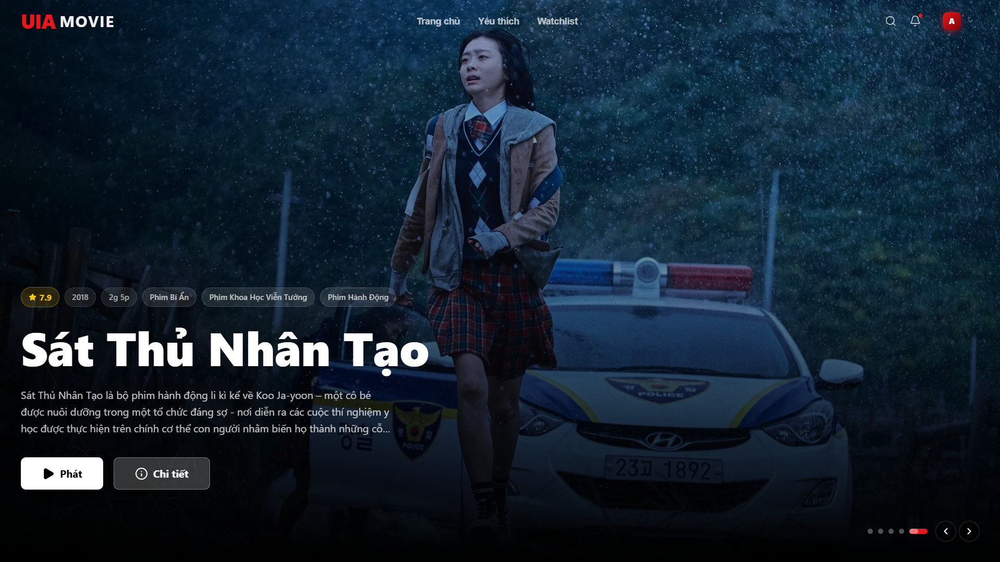
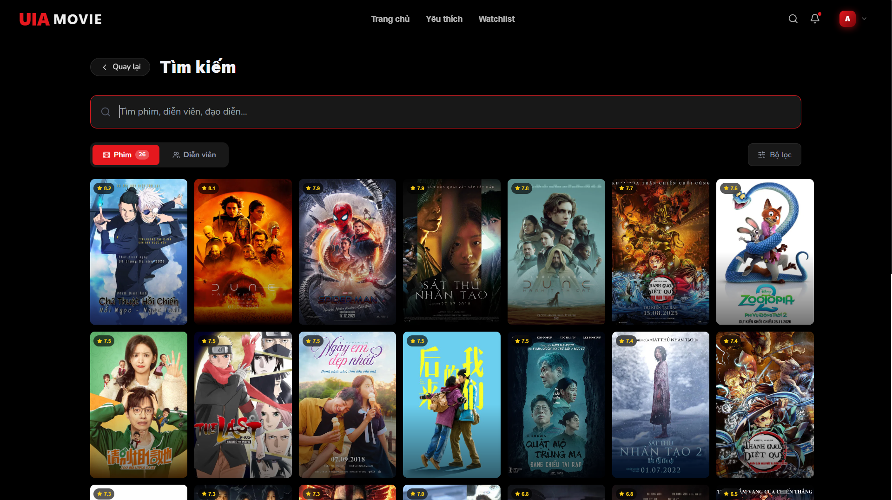
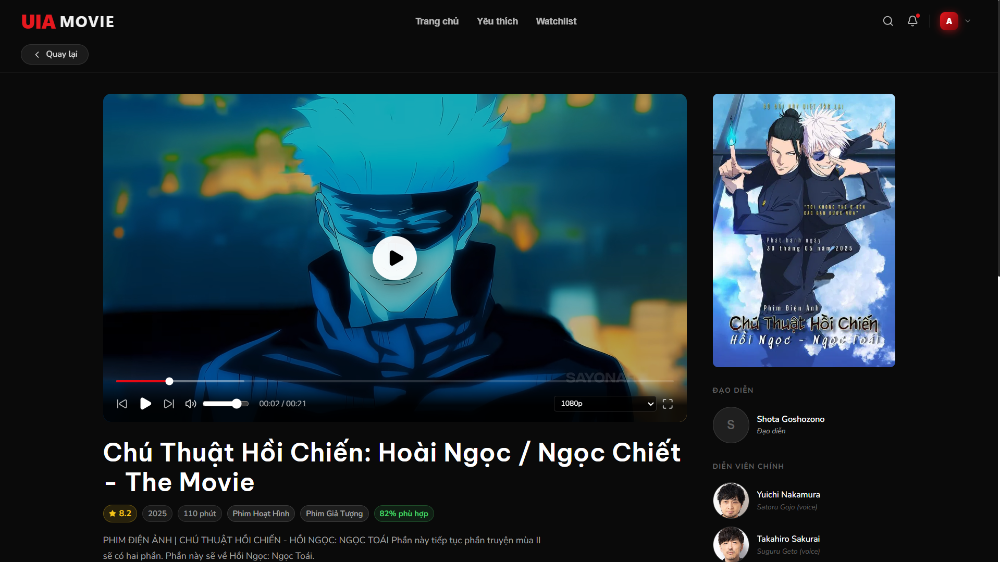
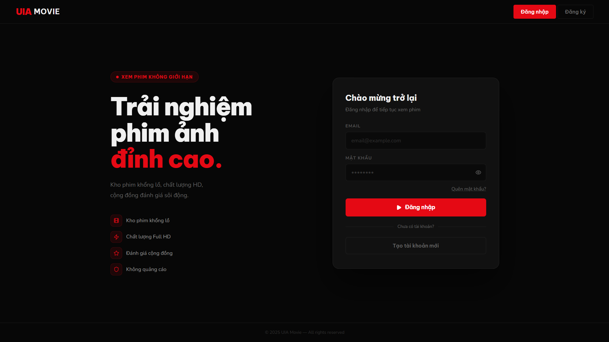
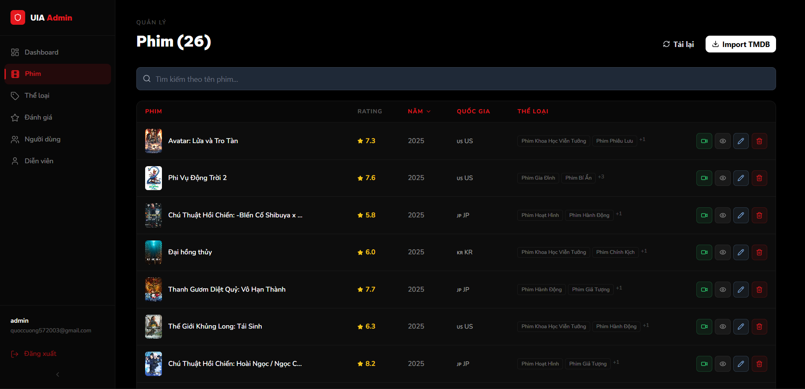

<div align="center">

# 🎬 UIA Movie

### A Netflix-inspired Movie Streaming Platform — Built with React 19 & Framer Motion

<br/>


<br/>

> A full-featured, production-ready movie streaming UI with dark cinema aesthetics,
> smooth animations, and a complete admin dashboard — all powered by a RESTful .NET backend.

</div>

---

## 🌐 Live Demo

| Resource | URL |
|---|---|
| 🖥️ **Frontend** | `https://uiamovie.vercel.app` |
| ⚙️ **Backend API** | `http://localhost:5000/api` |

> **Note:** The backend is self-hosted. Clone and run locally for full functionality.

---

## 📖 Overview

**UIA Movie** is a Netflix-style movie streaming frontend built entirely in React. It delivers a cinematic, dark-luxury browsing experience with fluid animations, a rich discovery system, and a complete admin control panel.

The app connects to a custom **.NET 8 REST API** backed by a SQL database and TMDB integration, allowing real movie data — posters, cast, descriptions, trailers — to be imported and served dynamically.

Whether you're a user browsing the latest K-Drama or an admin importing films from TMDB and managing users, UIA Movie has you covered.

---

## ✨ Features

### 🔐 Authentication
- Email/password login & registration with form validation
- **Two-Factor Authentication (2FA)** via OTP email
- Forgot password → OTP reset flow
- JWT access token + refresh token with **auto-silent refresh** via Axios interceptors
- Protected routes with role-based access (`User` / `Admin`)

### 🏠 Home & Discovery
- **Auto-playing HeroBanner** slideshow (5 slides, 6s interval) with cinematic transitions
- **Genre section** — horizontally scrollable cards with backdrop images and hover effects
- **Top 10 Today** ranked row with large numbered overlays
- **Country-based rows** — KR 🇰🇷 / CN 🇨🇳 / US 🇺🇸 / JP 🇯🇵 with per-country accent colors
- **"For You" recommendations** — genre-frequency engine based on personal watch history
- **Newly Released** & **Highly Rated** movie rows with smooth carousel navigation

### 🔍 Search & Filtering
- Real-time search for movies and actors in a unified interface
- Tab switching between **Movies** and **Actors** results
- Multi-filter panel: genre, release year, country, sort order, minimum rating slider
- Active filter chips with individual removal
- Actor cards with profile photos navigating to full person pages

### 🎬 Movie Detail
- Full detail page with backdrop hero, cast scroll row, genre badges, and runtime
- Integrated **review & rating system** — write, edit, delete your own reviews
- Rating statistics with star distribution breakdown
- Related cast cards that link to individual person profile pages
- TMDB-sourced cast, director bio, known-for filmography

### 👤 User Profile & Account
- Editable display name and avatar URL
- **Favorites** list — add/remove from any card or detail page
- **Watch History** — time-stamped, clearable individually or in bulk
- **Security settings** — change password, enable/disable 2FA

### 🛡️ Admin Dashboard
- **Stats overview** — total movies, genres, users, trending count
- **Movie management** — search, edit, delete, and manage video files
- **TMDB import tool** — search TMDB and one-click import with conflict detection
- **Video upload panel** — drag-and-drop upload to Cloudinary with real-time progress, cancel support, and quality/type selection
- **Genre CRUD** — create, edit, delete genres with color-coded cards
- **Review moderation** — browse and delete reviews per film
- **User management** — view details, edit username/avatar/subscription, change role, delete
- Collapsible sidebar navigation

### 📱 Responsive Design
- Mobile-first breakpoints via `useIsMobile` hook (< 768px)
- 2-column grid on mobile, auto-fill on desktop
- Touch-friendly scroll rows with `scroll-snap`
- Adaptive HeroBanner height, font sizes, and button sizing

---

## 🛠️ Tech Stack

| Category | Technology |
|---|---|
| **Framework** | React 19 |
| **Build Tool** | Vite 8 |
| **Routing** | React Router DOM v7 |
| **Animations** | Framer Motion 12 |
| **Styling** | Tailwind CSS 3 + Inline design tokens |
| **HTTP Client** | Axios 1.x with request/response interceptors |
| **Icons** | Lucide React |
| **Deployment** | Vercel (SPA rewrite configured) |
| **External Data** | TMDB API (via backend proxy) |
| **Media Storage** | Cloudinary (video upload) |

---

## 🎨 UI Highlights

UIA Movie is built around a **dark cinema aesthetic** — deep blacks, subtle grain texture overlays, and carefully tuned color accents.

### Design System
- **Color tokens** defined in `homeTokens.js` and `searchConstants.jsx` — a single source of truth for background, surface, accent (`#e5181e`), gold (`#f5c518`), and typography colors
- **Two typefaces**: `Be Vietnam Pro` (display/headings) + `Nunito` (body/UI)
- Consistent `border-radius`, spacing, and shadow scales across all components

### Animation Philosophy
- All transitions use **Framer Motion** with curated easing curves from `transitions.js`
- Card hover: scale + translateY + shadow elevation
- Page elements: staggered `opacity + y` entrance animations
- HeroBanner: crossfade backdrop + slide content with directional awareness
- Modals: spring-based scale-in from center
- Sidebar: animated width collapse (220px ↔ 64px)

### Scroll & Navigation UX
- Horizontal scroll rows with **fade edge masks** and **ghost nav arrows** (appear on row hover)
- Scroll-snap on mobile for card rows
- `ScrollToTop` component resets position on every route change
- Sticky filter bar with `backdrop-filter: blur`

---

## 🔌 API Integration

All API communication goes through a centralized **Axios instance** (`src/config/axios.js`):

```
Base URL: http://localhost:5000/api/
```

### Token Strategy
- `accessToken` and `refreshToken` stored in `localStorage`
- Every request automatically attaches `Authorization: Bearer <token>` via a **request interceptor**
- On **401 responses**, a **response interceptor** silently calls `/auth/refresh-token`
- Concurrent requests during refresh are **queued** and replayed after the new token is received
- On refresh failure → session cleared → redirect to `/welcome`

### Service Modules

| Service | Responsibility |
|---|---|
| `authService.js` | Login, register, OTP, forgot/reset password, session management |
| `movieService.js` | Trending, search, by-genre, by-country, favorites, watch history, video progress |
| `genreService.js` | Genre CRUD |
| `personService.js` | Cast, person detail & images via TMDB proxy |
| `reviewService.js` | Movie reviews — create, edit, delete, stats, check-if-reviewed |

---

## 📁 Project Structure

```
src/
├── components/
│   ├── admin/          # Admin-only panels, modals, tables
│   │   ├── movie/      # MovieDetailPanel, VideoUploadPanel
│   │   └── user/       # UserDetailPanel, UserEditModal
│   ├── common/         # BackButton, Pagination, SeeAllButton
│   ├── home/           # HeroBanner, GenreSection, MovieRow,
│   │   │               # TopRankedRow, CountryMovieRows, TrendingSection
│   ├── layout/         # Navbar, Footer
│   ├── movie/          # MovieCard, MovieCarousel, PersonScrollRow
│   ├── search/         # SearchBar, SearchTabs, FilterPanel,
│   │   │               # MovieCard (search), ActorCard, SearchUI
│   └── ui/             # Button, Input, Modal, Badge, Spinner, RatingStars
│
├── config/
│   └── axios.js        # Axios instance + interceptors
│
├── context/
│   └── homeTokens.js   # Global design tokens (colors, fonts, genre maps)
│
├── hooks/
│   ├── useIsMobile.js  # Responsive breakpoint hook
│   └── usePagination.js# Client & server-side pagination hook
│
├── motion-configs/
│   ├── transitions.js  # Framer Motion timing presets
│   └── variants.js     # Reusable animation variants
│
├── pages/
│   ├── admin/          # AdminPage, AdminDashboard, AdminMovies,
│   │   │               # AdminGenres, AdminReviews, AdminUsers,
│   │   │               # AdminPersons, AdminTmdbSearch
│   └── user/           # HomePage, MovieDetailPage, MovieInfoPage,
│                       # SearchPage, BrowsePage, ProfilePage,
│                       # SecurityPage, FavoritesPage, WatchHistoryPage,
│                       # PersonPage, LandingPage
│
├── router/
│   └── AppRouter.jsx   # BrowserRouter + protected/guest routes
│
└── services/           # authService, movieService, genreService,
                        # personService, reviewService
```

---

## 🚀 Installation & Setup

### Prerequisites
- Node.js ≥ 18
- The backend API running at `http://localhost:5000`

### Steps

```bash
# 1. Clone the repository
git clone https://github.com/your-username/uia-movie.git
cd uia-movie

# 2. Install dependencies
npm install

# 3. Configure environment (see section below)
cp .env.example .env

# 4. Start the development server
npm run dev
```

The app will be available at `http://localhost:5173`.

### Build for Production

```bash
npm run build
npm run preview
```

---

## ⚙️ Environment Variables

Create a `.env` file at the project root:

```env
# Backend API base URL
VITE_API_URL=http://localhost:5000/api
```

> The Axios instance reads from `VITE_API_URL` at build time.
> For Vercel deployments, add this variable in the Vercel project settings.

---

## 📋 Usage

### As a Regular User
1. Navigate to `/welcome` — register or log in
2. Browse the home feed — trending, by country, top-rated, personalized rows
3. Click any movie to open the **detail page** — read info, watch trailer, write a review
4. Use the **Search** page to find movies or actors with advanced filters
5. Manage your **Favorites** and review your **Watch History** from the navbar
6. Update your profile or toggle 2FA under **Profile** / **Security Settings**

### As an Admin
1. Log in with an Admin-role account — you will see an **Admin** link in the navbar
2. Use the **Dashboard** for a quick system overview
3. Go to **Movies → TMDB Search** to search and import new films
4. Upload video files from the **Movie Detail panel** with quality and type selection
5. Manage **Genres**, **Reviews**, **Users**, and **Persons** from the sidebar

---

## 📸 Screenshots

> *(Replace placeholders with actual screenshots)*

| Screen | Preview |
|---|---|
| 🏠 Home — Hero Banner |  |
| 🔍 Search with Filters |  |
| 🎬 Movie Detail |  |
| 👤 Login / Register |  |
| 🛡️ Admin Dashboard |  |

---

## 🔮 Future Improvements

- [ ] **Video Player** — integrate a full-featured HLS player with quality switching
- [ ] **Watchlist / Continue Watching** — resume from last position with progress bar
- [ ] **Notifications** — real-time alerts for new releases or admin actions
- [ ] **Dark / Light mode** — theme toggle preserving cinema feel in light mode
- [ ] **Infinite scroll** — replace pagination with virtual scroll on Browse page
- [ ] **Social features** — follow other users, see their watchlists
- [ ] **Offline support** — PWA with service worker caching for core UI
- [ ] **i18n** — full English / Vietnamese language toggle
- [ ] **Performance** — image lazy loading with blur-up placeholders, React.lazy code splitting per route
- [ ] **Testing** — Vitest unit tests for services and hooks; Playwright E2E for auth and browsing flows

---

## 👨‍💻 Author

**Quoc Cuong**
- Facebook: [gnoucdasick](https://www.facebook.com/gnoucdasick/)
- Email: [quoccuong572003@gmail.com](mailto:quoccuong572003@gmail.com)

---

## 📄 License

This project is licensed under the **MIT License** — see the [LICENSE](LICENSE) file for details.

---

<div align="center">

Made with ❤️ and a lot of ☕ — inspired by Netflix, built for learning.

**⭐ Star this repo if you found it useful!**

</div>
